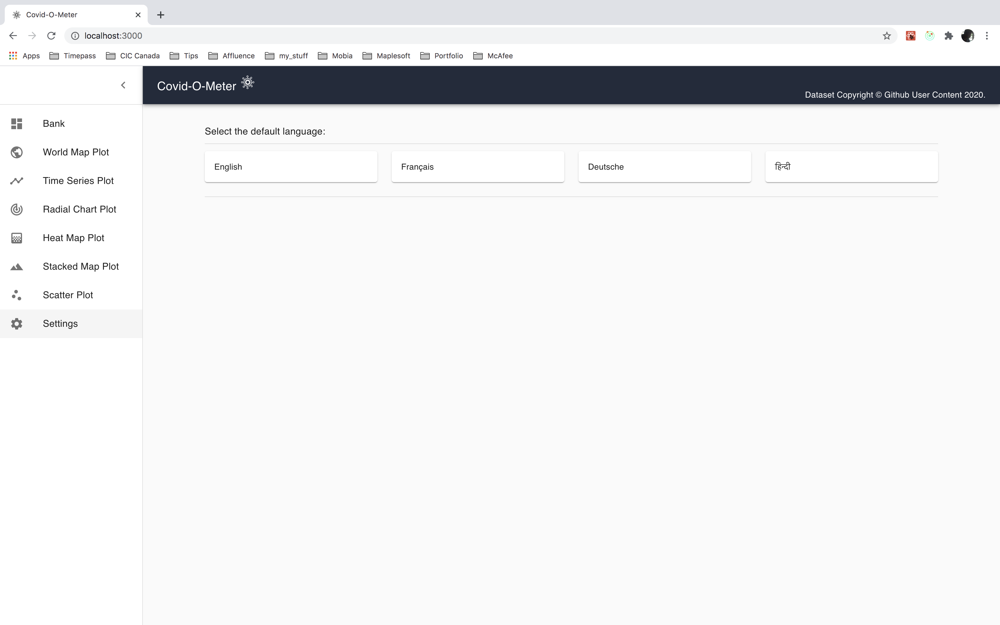

Covid-O-Meter: A Simple Application which fetches the Data and plots them.

TABLE OF CONTENTS

 <pre> INTRODUCTION </pre>
<pre> SPECIFICATIONS </pre>
<pre> SOFTWARES REQUIRED </pre>
<pre> SOURCE CODE </pre>
<pre> INSTALLATION NOTES </pre>
<pre> ABOUT THE APPLICATION </pre>

INTRODUCTION

 This application fetches the Real-time dataset and plots them in the server. Once plotting is completed, the visualization is sent to the Client. The application can also be visualized in 4 different languages.
  
<b>Check out this video to see the demo.</b>

<pre><i>If the above video doesn't seem to work, you can find the same clip of Demo at (~/readme_figs/DemoVideos/CovidOMeterDemo.mp4) location.</i></pre>

SPECIFICATIONS

 <pre>The application is a Simple application consisting of a Python server and a React client:</pre>
<ul>
<li> Fetches the information from <a href='https://github.com/datasets/covid-19/blob/master/data/countries-aggregated.csv'>here</a>.</li>
<li> Plot the csv data into the desired graph(World Map for the time-being).</li>
<li> The co-ordinates information is retrieved from <a href='http://nominatim.openstreetmap.org/'>OpenStreetMap API</a>. </li>
<li> Convert the plotted map PNG images into a GIF. </li>
<li> Once the plotting is complete then tranfer it to client via an API upon request.</li>
<li> Display the retrieved plotted GIF</li>
<li> Provide the user with option to change the Default languages.</li>
<li> At the time being, 4 languages are being supported: English, French, German and Hindi.</li>
</ul>
<pre>When the user clicks the 'Bank' option:</pre>
<ul>
<li> Make an API request to the Python server.</li>
<li> Render the fetched GIF on the Screen to the User.</li>
</ul>
<pre>When the user clicks the 'Settings' options:</pre>
<ul>
<li> Facilitate the User with options to switch between languages. </li>
<li> Change the default language across the application upon user selection.</li>
</ul>

SOFTWARES REQUIRED

 The software that are needed for the application to be edited or executed

<ul>
<li> OPERATING SYSTEM UTILIZED: MAC OS- High Sierra (10.13.6) </li>
<li> ‘client’ --> Node JS, React, HTML, JavaScript, CSS</li>
<li> ‘server’ --> Python.</li>
<li> ‘build tools’ --> YARN, NPM</li>
</ul>

SOURCE CODE

 The Source code for the application is in the ‘Covid_o_meter’ folder

<ul>
<li> ‘server’ --> This folder has the source code for the API server.</li>
<li> ‘client’ --> This folder has the source code for the UI client.</li>
</ul>

INSTALLATION NOTES

 All the execution of this application will be done via command prompt terminal. <b>Assuming you have Node, React, npm/yarn and Python (version >3.0) already installed</b>

<ol type="A">
<li> ‘Server Side Installation’ </li>
	<ul>
		<li> Navigate into your '/server/' and in your terminal </li>
		<li> Run the following command for Mac OS executable:  <b>./dependencies_install</b></li>
		<li> Run the following command for Windows OS executable:  <b>dependencies_install.bat</b></li>
		<li> Run the following command for Linux OS executable:  <b>start dependencies_install.bat</b></li>
		<li> Run the following command for Mac. windows, linux OS executable together:  <b>python manage.py runserver 2393</b></li>
	</ul>
<li> ‘Client Side Installation’ </li>
	<ul>
		<li> Navigate into your '/client/' and install the dependencies using the command  <b>npm install</b>  </li>
		<li> Run the application: <b>[from ~/Covid_o_meter/] npm client Or yarn exeApp   Or   [from ~/Covid_o_meter/client/] npm start </b></li>
	</ul>
	</ol>

ABOUT THE APPLICATION

 This application opens up a window after you have installed and initiated the step given in the ‘INSTALLATION NOTES’ section.
The application loads and opens up a Tab window in CHROME (or your Default Browser) and a Circular Loading is displayed until the API fetches the GIF information. Figure 1 shows the screen when the application is loaded.

    Figure 1: Start-up Screen/ Loading Screen

    Figure 2: Display of the Plotted information after its fetched and rendered on UI.

    Figure 3: Display of the 'Settings' tab with the 'Sidebar' panel open.

    Figure 4: Display of the Application with Language altered.
